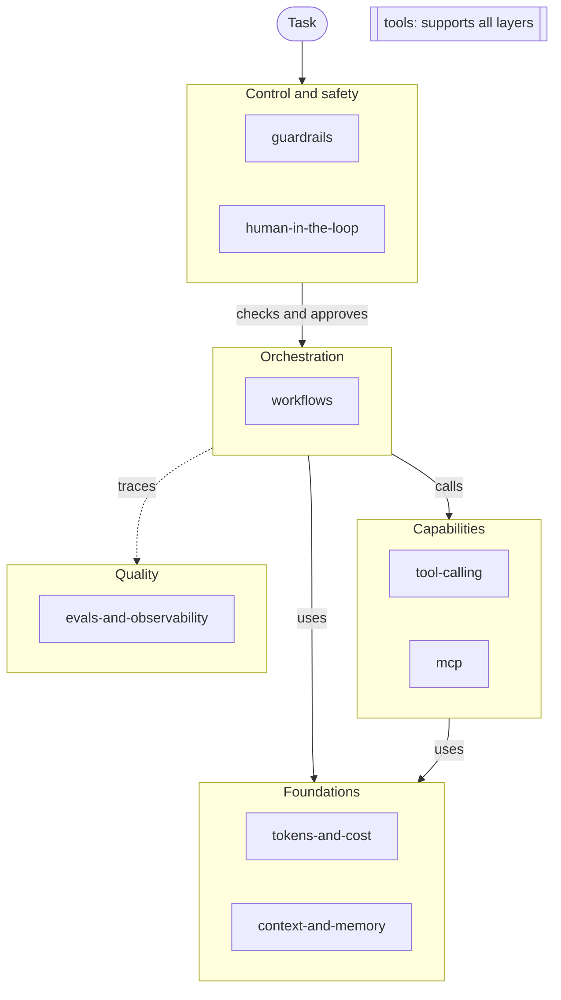

# Overview: a map of an agentic AI system

This map shows the place of each topic in one agentic AI system.
Read it before you add a topic or a note.

## Layers

- Foundations: The model reads tokens, and each token has a cost. The context window and the memory hold what the agent knows.
- Capabilities: Tools let the agent act outside the model. MCP gives one protocol to connect tools and data to an agent.
- Orchestration: The agent loop plans the work, calls tools, and reads the results. A workflow connects the steps and the agents until the task is complete.
- Control and safety: Guardrails limit what the agent can read and do. A person approves the high-risk steps and takes control when the agent stops.
- Quality: Evals measure the output of the agent. Traces and metrics show each step, its tokens, and its cost.

The `tools` topic supports all layers. It lists the skills, plugins, MCP servers, and CLI tools that the owner uses.

## Topics

Each topic folder has one row in this table. `make check` fails when a topic folder has no row.

| Layer | Topic | Scope |
|---|---|---|
| Foundations | [tokens-and-cost](topics/tokens-and-cost/README.md) | Token counting, prompt caching, model choice by cost. |
| Foundations | [context-and-memory](topics/context-and-memory/README.md) | Context windows, short-term and long-term memory, compaction, retrieval for agents. |
| Capabilities | [tool-calling](topics/tool-calling/README.md) | Tool design, schemas, error handling. |
| Capabilities | [mcp](topics/mcp/README.md) | MCP servers, clients, transports, and security. |
| Orchestration | [workflows](topics/workflows/README.md) | Agent loops, planning, multi-agent patterns, long-running tasks. |
| Control and safety | [human-in-the-loop](topics/human-in-the-loop/README.md) | Approval points, review steps, handoff between the agent and a person. |
| Control and safety | [guardrails](topics/guardrails/README.md) | Permissions, input and output checks, sandboxes, prompt injection. |
| Quality | [evals-and-observability](topics/evals-and-observability/README.md) | Evaluation of agent output, traces, metrics, cost tracking. |
| All layers | [tools](topics/tools/README.md) | Skills, plugins, MCP servers, and CLI tools that the owner uses, with the opinion of the owner. |

## Interactive diagram

Open [assets/overview.html](assets/overview.html) in a browser to see an interactive version of this map.
The source of that diagram is `assets/overview.json`.
