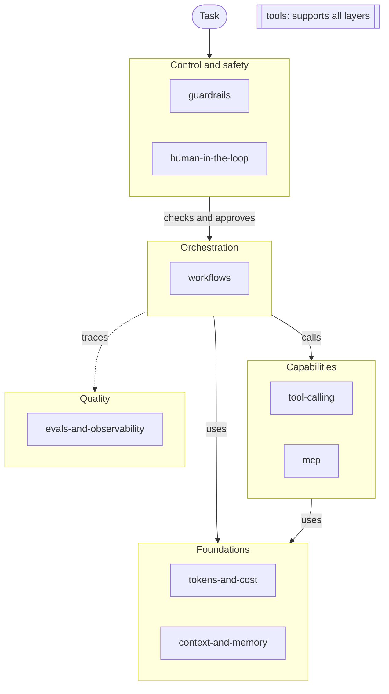

# Amendment 1: Overview Map and Tools Implementation Plan

> **For agentic workers:** REQUIRED SUB-SKILL: Use superpowers:subagent-driven-development (recommended) or superpowers:executing-plans to implement this plan task-by-task. Steps use checkbox (`- [ ]`) syntax for tracking.

**Goal:** Add `OVERVIEW.md` with a map of an agentic AI system, five new topics (four knowledge topics and `tools`), a check that each topic has an overview row, tool category files with checked entries, and `kb-ingest` support for `# tool:` inputs.

**Architecture:** Content first: the new topic folders, `OVERVIEW.md`, and the Archify overview go in before any check that needs them, so `make check` passes after each task. Then three small, independent tool changes: `build_index.py` checks the overview table, `check_notes.py` checks tool entries in `topics/tools/`, and `ste_check.py` skips the `My verdict:` line. Last, the templates, the skill, and the contributor docs describe the new flow, and a real `kb-ingest` run proves it.

**Tech Stack:** Python 3.10+ (standard library, `unittest`), GNU Make, the vendored `ste-lint.py`, Archify 3.0.1 (`~/.agents/skills/archify`), Mermaid (GitHub render, local check with `mermaid@11.12.0`), Pandoc and Google Chrome for the local Mermaid check.

**Spec:** `docs/superpowers/specs/2026-10-04-ai-engineering-notes-design.md`, section 14 (Amendment 1), with the amended rows in sections 2, 3, and 13. The base plan is `docs/superpowers/plans/2026-10-04-ai-engineering-notes.md`. It is complete (commits `fbe931e` to `89ab69a`).

## Global Constraints

- All repository content is in English and follows ASD-STE100 principles. Use the `asd-ste100` skill.
- Explanations use STE-flavored mode. Procedures, checklists, and prompt templates use Strict mode between `<!-- ste:strict -->` and `<!-- /ste:strict -->`.
- All tools in `tools/` use Python 3 and the standard library only. The floor is Python 3.10. CI runs Python 3.10.
- Do not change `tools/ste-lint.py`. It is a verbatim copy at commit `7d4a135a199a5d7447c4886bcd7ffe742a627bc9`.
- Generated sections sit between `<!-- index:start -->` and `<!-- index:end -->`. Nobody edits them by hand. Run `make index` to update them.
- Five layers, exact names: Foundations (`tokens-and-cost`, `context-and-memory`), Capabilities (`tool-calling`, `mcp`), Orchestration (`workflows`), Control and safety (`human-in-the-loop`, `guardrails`), Quality (`evals-and-observability`). `tools` supports all layers.
- Tool entry fields, exact labels: `Type:` (`skill | plugin | MCP server | CLI`), `Link:`, `Use for:`, `Status:` (`using | tried | dropped`), `My verdict:`.
- `My verdict` is the opinion of the owner. Nobody rewrites it. The STE rules apply to the other lines.
- The `kb-ingest` skill does not commit and does not push. The owner commits notes.
- Keep the repo-local git identity (`ltlongtma` noreply). Do not change it.
- The active `gh` account is the work account. For this repository, prefix `gh` commands with `GH_TOKEN=$(gh auth token -u ltlongtma)`. Do not switch the active account.
- `~/.gitignore_global` ignores `docs/superpowers/`. The repository `.gitignore` keeps the line `!docs/superpowers/`. Do not remove it.
- Run all commands from the repository root: `/Users/longluu/Documents/Personal/ai-engineering-notes`.

## Resolved Open Items

Evidence collected on 2026-10-04 during planning, in scratch copies outside the repository:

1. **Archify overview.** The `assets/overview.json` candidate in Task 1 passed `finalize` on the first run with Archify 3.0.1: `validate`, `deliver`, `check`, and `browser-check` all `pass`, 0 diagnostics, no visual review signals. Output files: `assets/overview.html`, `assets/overview.delivery.json`, and three receipts in `.archify/overview/`. The current `.gitignore` ignores `topics/*/assets/*.delivery.json` only, so Task 1 adds `/assets/*.delivery.json`.
2. **Mermaid map.** The Task 1 map renders with `mermaid@11.12.0` (the version that `tools/export.py` uses). It also renders through the existing `render_pdf` path: the PDF text shows the node labels, not the `flowchart TB` source.
3. **STE.** The `OVERVIEW.md`, `templates/tools.md`, topic README, `CONTRIBUTING.md`, and `SKILL.md` text in this plan passes `tools/ste_check.py` with 0 errors and 0 warnings.
4. **Code.** The code and tests of Tasks 2, 3, and 4, applied to a copy of the repository, pass: 50 tests, `make check` clean. Without the changes, a `My verdict:` line with a semicolon gives `semicolon` (error) and `passive-voice` (warning).

## Plan Decisions

These decisions fill gaps in the spec. The owner can reject each one during plan review.

| # | Decision | Reason |
|---|---|---|
| D1 | A row of the `OVERVIEW.md` topic table is a line that starts with `\|` and contains a link `](topics/<name>/README.md)`. A link in prose does not count. | The spec says "a row in the `OVERVIEW.md` table". The topic links in the root `README.md` index use the same target. |
| D2 | `build_index.py` also reports a table row that links a topic folder that does not exist, and a missing `OVERVIEW.md`. These fail `--check`. Without `--check`, the tool still writes the indexes, prints the overview errors, and exits 1. | A renamed topic leaves a dead link in the table. `make index` must show the same error as `make check`. |
| D3 | The tool entry check applies to each file in `topics/tools/` except `README.md`. An entry is a `### ` heading in the `## Tools` section. A `Link:` line needs a value. A `Status:` value must be exactly `using`, `tried`, or `dropped` (lowercase, no other words). | The spec lists the error conditions. An empty `Link:` is the same as no link. Exact values keep the field useful for a later filter. |
| D4 | `ste_check.py` ignores each line that starts with `- My verdict:` (or `* My verdict:`), in all Markdown files and in Strict blocks. A verdict is one line. | The spec says the STE rules apply to the other lines. A verdict can contain a semicolon or a passive sentence. |
| D5 | For a `# tool:` input, the skill proposes `Status` from the words of the verdict. If the verdict does not show the status, the skill proposes `using` and says so in the proposal. The owner can change it with `edit`. | The spec gives the input form `# tool: <verdict>` only, but each entry needs a valid `Status:` line. |
| D6 | When the owner accepts a new topic, phase 2 adds the accepted table row and the Mermaid node to `OVERVIEW.md`. It changes no other overview text and does not change `assets/overview.json`. It tells the owner to update the Archify files. | `make check` must pass after phase 2, and the owner approved the exact row in the Placement block. The spec says that the owner writes and changes the overview. |
| D7 | The `tools` topic starts with `README.md` only. The first category file comes from the first tool input. | Spec section 3: each starting topic contains only a `README.md`. |
| D8 | The Archify overview is an `architecture` diagram. Its cards repeat the layer sentences of `OVERVIEW.md`. | One source of wording for the two views. |

## Review Focus

1. A new topic folder with no row in the `OVERVIEW.md` table, while a prose sentence links the topic. Expected: `make check` fails and names the folder, because a prose link is not a row. Tests: Task 2.
2. A tool entry with `Status: Using`, `Status: using daily`, an empty `Status:`, or the template text `using | tried | dropped`. Expected: one error for that entry. Test: Task 3.
3. A tool entry with `- Link:` and no value. Expected: the same error as no `Link:` line. Test: Task 3.
4. A verdict of the owner with a semicolon or a passive sentence, also in a Strict block. Expected: no finding on that line, and the other entry lines are still checked. Tests: Task 4.
5. A topic folder that is renamed or removed, and its old row stays in the table. Expected: `make check` fails and names the dead row. Test: Task 2.

## File Structure

| Path | Responsibility | Task |
|---|---|---|
| `topics/{workflows,human-in-the-loop,guardrails,evals-and-observability,tools}/README.md` | New topics, one-line scope, generated note list. | 1 |
| `OVERVIEW.md` | Mermaid map, layer sentences, topic table, link to the Archify HTML. | 1 |
| `assets/overview.json`, `assets/overview.html` | Archify source and rendered map. | 1 |
| `README.md` | Link to `OVERVIEW.md`. Regenerated topic index. | 1 |
| `.gitignore` | Ignore `/assets/*.delivery.json`. | 1 |
| `tools/build_index.py`, `tools/tests/test_build_index.py`, `tools/tests/fixtures/kb/OVERVIEW.md` | Overview row check (spec 14.1). | 2 |
| `tools/check_notes.py`, `tools/tests/test_check_notes.py`, `tools/tests/fixtures/kb/topics/tools/*` | Tool entry check (spec 14.2). | 3 |
| `tools/ste_check.py`, `tools/tests/test_ste_check.py` | Skip `My verdict:` lines. | 4 |
| `templates/tools.md`, `templates/review.md`, `.claude/skills/kb-ingest/SKILL.md`, `CONTRIBUTING.md` | Tool template, review template, skill, and contributor docs. | 5 |
| `inbox/links.md` (owner), `topics/tools/<category>.md` (skill) | Acceptance run. | 6 |

Test command (unchanged). Line numbers in each task refer to the file before that task starts.

```bash
python3 -m unittest discover -s tools/tests -t tools
```

---

### Task 1: New topics, OVERVIEW.md, and the Archify overview

**Files:**
- Create: `topics/workflows/README.md`, `topics/human-in-the-loop/README.md`, `topics/guardrails/README.md`, `topics/evals-and-observability/README.md`, `topics/tools/README.md`
- Create: `OVERVIEW.md`, `assets/overview.json`, `assets/overview.html` (Archify output)
- Modify: `README.md:3-6` (add the link), `README.md` index section (`make index` writes it)
- Modify: `.gitignore`

**Interfaces:**
- Consumes: the topic README form with a `Scope: ` line and index markers (base plan Task 4). `make index`, `make check`.
- Produces: `OVERVIEW.md` with a topic table. Each row links `topics/<name>/README.md`. Task 2 checks these rows. The `tools` topic folder, which Task 3 checks.

This task adds content only. No unit test applies. The check is `make check` plus a render check.

- [ ] **Step 1: Create the five topic READMEs**

Each file has the same form as `topics/mcp/README.md`. Run:

```bash
mk() {
  mkdir -p "topics/$1"
  printf '# %s\n\nScope: %s\n\n## Notes\n\nThe tool `tools/build_index.py` writes this list. Do not edit it.\n\n<!-- index:start -->\nNo notes yet.\n<!-- index:end -->\n' "$1" "$2" > "topics/$1/README.md"
}
mk workflows "Agent loops, planning, multi-agent patterns, long-running tasks."
mk human-in-the-loop "Approval points, review steps, handoff between the agent and a person."
mk guardrails "Permissions, input and output checks, sandboxes, prompt injection."
mk evals-and-observability "Evaluation of agent output, traces, metrics, cost tracking."
mk tools "Skills, plugins, MCP servers, and CLI tools that the owner uses, with the opinion of the owner."
cat topics/tools/README.md
```

Expected `topics/tools/README.md`:

```markdown
# tools

Scope: Skills, plugins, MCP servers, and CLI tools that the owner uses, with the opinion of the owner.

## Notes

The tool `tools/build_index.py` writes this list. Do not edit it.

<!-- index:start -->
No notes yet.
<!-- index:end -->
```

- [ ] **Step 2: Write `OVERVIEW.md`**

````markdown
# Overview: a map of an agentic AI system

This map shows the place of each topic in one agentic AI system.
Read it before you add a topic or a note.



## Layers

- Foundations: The model reads tokens, and each token has a cost. The context window and the memory hold what the agent knows.
- Capabilities: Tools let the agent act outside the model. MCP gives one protocol to connect tools and data to an agent.
- Orchestration: The agent loop plans the work, calls tools, and reads the results. A workflow connects the steps and the agents until the task is complete.
- Control and safety: Guardrails limit what the agent can read and do. A person approves the high-risk steps and takes control when the agent stops.
- Quality: Evals measure the output of the agent. Traces and metrics show each step, its tokens, and its cost.

The `tools` topic supports all layers. It lists the skills, plugins, MCP servers, and CLI tools that the owner uses.

## Topics

Each topic folder has one row in this table. `make check` fails when a topic folder has no row.

| Layer | Topic | Scope |
|---|---|---|
| Foundations | [tokens-and-cost](topics/tokens-and-cost/README.md) | Token counting, prompt caching, model choice by cost. |
| Foundations | [context-and-memory](topics/context-and-memory/README.md) | Context windows, short-term and long-term memory, compaction, retrieval for agents. |
| Capabilities | [tool-calling](topics/tool-calling/README.md) | Tool design, schemas, error handling. |
| Capabilities | [mcp](topics/mcp/README.md) | MCP servers, clients, transports, and security. |
| Orchestration | [workflows](topics/workflows/README.md) | Agent loops, planning, multi-agent patterns, long-running tasks. |
| Control and safety | [human-in-the-loop](topics/human-in-the-loop/README.md) | Approval points, review steps, handoff between the agent and a person. |
| Control and safety | [guardrails](topics/guardrails/README.md) | Permissions, input and output checks, sandboxes, prompt injection. |
| Quality | [evals-and-observability](topics/evals-and-observability/README.md) | Evaluation of agent output, traces, metrics, cost tracking. |
| All layers | [tools](topics/tools/README.md) | Skills, plugins, MCP servers, and CLI tools that the owner uses, with the opinion of the owner. |

## Interactive diagram

Open [assets/overview.html](assets/overview.html) in a browser to see an interactive version of this map.
The source of that diagram is `assets/overview.json`.
````

The sentence "`make check` fails when a topic folder has no row." becomes true in Task 2.

- [ ] **Step 3: Write `assets/overview.json`**

```json
{
  "schema_version": 1,
  "diagram_type": "architecture",
  "meta": {
    "title": "Map of an agentic AI system",
    "output": "assets/overview.html",
    "locale": "en",
    "quality_profile": "showcase"
  },
  "components": [
    { "id": "task", "type": "external", "label": "Task", "sublabel": "from a person or a system", "pos": [40, 220], "size": [150, 64] },
    { "id": "guardrails", "type": "security", "label": "Guardrails", "sublabel": "guardrails", "tag": "Control and safety", "pos": [280, 220], "size": [150, 64] },
    { "id": "agent-loop", "type": "backend", "label": "Agent loop", "sublabel": "workflows", "tag": "Orchestration", "pos": [520, 220], "size": [160, 64] },
    { "id": "tool-calls", "type": "backend", "label": "Tool calls", "sublabel": "tool-calling", "tag": "Capabilities", "pos": [780, 220], "size": [150, 64] },
    { "id": "mcp-servers", "type": "cloud", "label": "MCP servers", "sublabel": "mcp", "tag": "Capabilities", "pos": [1030, 220], "size": [150, 64] },
    { "id": "person", "type": "external", "label": "Person in the loop", "sublabel": "human-in-the-loop", "tag": "Control and safety", "pos": [520, 50], "size": [160, 64] },
    { "id": "evals", "type": "messagebus", "label": "Evals and traces", "sublabel": "evals-and-observability", "tag": "Quality", "pos": [780, 50], "size": [150, 64] },
    { "id": "context", "type": "database", "label": "Context and memory", "sublabel": "context-and-memory", "tag": "Foundations", "pos": [400, 400], "size": [170, 64] },
    { "id": "model", "type": "cloud", "label": "Model and tokens", "sublabel": "tokens-and-cost", "tag": "Foundations", "pos": [640, 400], "size": [160, 64] }
  ],
  "connections": [
    { "id": "task-in", "from": "task", "to": "guardrails", "label": "input" },
    { "id": "checked-input", "from": "guardrails", "to": "agent-loop", "label": "checked input", "variant": "security" },
    { "id": "call-tool", "from": "agent-loop", "to": "tool-calls", "label": "call tool", "variant": "emphasis" },
    { "id": "mcp-request", "from": "tool-calls", "to": "mcp-servers", "label": "MCP request" },
    { "id": "approval", "from": "agent-loop", "to": "person", "label": "ask approval", "fromSide": "top", "toSide": "bottom" },
    { "id": "traces", "from": "tool-calls", "to": "evals", "label": "traces", "variant": "dashed", "fromSide": "top", "toSide": "bottom" },
    { "id": "read-context", "from": "agent-loop", "to": "context", "label": "read and write", "fromSide": "bottom", "toSide": "top" },
    { "id": "prompt-model", "from": "agent-loop", "to": "model", "label": "prompt", "fromSide": "bottom", "toSide": "top" }
  ],
  "cards": [
    { "dot": "slate", "title": "Foundations", "items": ["The model reads tokens, and each token has a cost.", "The context window and the memory hold what the agent knows."] },
    { "dot": "cyan", "title": "Capabilities", "items": ["Tools let the agent act outside the model.", "MCP gives one protocol to connect tools and data to an agent."] },
    { "dot": "emerald", "title": "Orchestration", "items": ["The agent loop plans the work, calls tools, and reads the results.", "A workflow connects the steps and the agents until the task is complete."] },
    { "dot": "rose", "title": "Control and safety", "items": ["Guardrails limit what the agent can read and do.", "A person approves the high-risk steps and takes control when the agent stops."] },
    { "dot": "amber", "title": "Quality", "items": ["Evals measure the output of the agent.", "Traces and metrics show each step, its tokens, and its cost."] },
    { "dot": "violet", "title": "Tools", "items": ["The tools topic supports all layers.", "It lists the skills, plugins, MCP servers, and CLI tools that the owner uses."] }
  ]
}
```

- [ ] **Step 4: Render the Archify HTML**

This is the Archify command of the `kb-ingest` skill, with paths in `assets/` (spec 14.1):

```bash
node ~/.agents/skills/archify/bin/archify.mjs finalize architecture assets/overview.json assets/overview.html --quality showcase --out-dir .archify/overview --json
```

Expected: exit 0, `"status": "pass"`, and each of `validate`, `deliver`, `check`, `browser-check` is `"pass"`. Files: `assets/overview.html`, `assets/overview.delivery.json`. If a gate fails, read the `archify` skill section "Fast authoring path", step 5. Repair only positions and sizes. Keep the nodes, the connections, and the card text.

- [ ] **Step 5: Ignore the Archify delivery file**

Add one line to `.gitignore`, after the line `topics/*/assets/*.delivery.json`:

```gitignore
/assets/*.delivery.json
```

Run: `git status --short --untracked-files=all assets`
Expected: exactly `?? assets/overview.html` and `?? assets/overview.json`.

- [ ] **Step 6: Link `OVERVIEW.md` from the root README**

In `README.md`, after the goals list (line 6), add a blank line and this line:

```markdown
[OVERVIEW.md](OVERVIEW.md) shows the place of each topic in a map of an agentic AI system.
```

- [ ] **Step 7: Regenerate the indexes and run the checks**

Run: `make index && make check`
Expected:
- `make index` prints `updated README.md`.
- `ste_check: 17 files, 0 errors, 0 warnings`
- `check_notes: 2 notes, 0 errors`
- `build_index --check: 10 files, 0 not current`
- `Ran 38 tests` and `OK`.

The root README index now lists nine topics, in this order: `context-and-memory`, `evals-and-observability`, `guardrails`, `human-in-the-loop`, `mcp`, `tokens-and-cost`, `tool-calling`, `tools`, `workflows`.

- [ ] **Step 8: Check that the Mermaid map renders**

Run:

```bash
mkdir -p dist
python3 -c "import sys; sys.path.insert(0, 'tools'); from pathlib import Path; from export import render_pdf; render_pdf(Path('OVERVIEW.md').read_text(encoding='utf-8'), Path('dist/overview.pdf').resolve(), 'Overview')"
pdftotext dist/overview.pdf - | grep -q 'flowchart TB' && echo "NOT RENDERED" || echo "rendered"
```

Expected: `rendered`. The text contains the node and edge labels, for example `checks and approves`. Git ignores `dist/`. If `pdftotext` is not installed, open `dist/overview.pdf` and look at the map.

- [ ] **Step 9: Check that `assets/overview.html` opens in a browser**

Run: `open assets/overview.html` (an agent can serve the folder with `python3 -m http.server` and open it in a browser tab).
Expected: the title "Map of an agentic AI system", nine nodes, eight arrows, six cards (Foundations, Capabilities, Orchestration, Control and safety, Quality, Tools), and no console errors. This is spec acceptance criterion 8.

- [ ] **Step 10: Commit**

```bash
git add topics/workflows topics/human-in-the-loop topics/guardrails topics/evals-and-observability topics/tools OVERVIEW.md assets/overview.json assets/overview.html README.md .gitignore
git commit -m "docs: add overview map and agentic topics"
```

---

### Task 2: `build_index.py` checks the overview table

**Files:**
- Modify: `tools/build_index.py:5-12` (imports, constants), insert after line 72 (new function), `tools/build_index.py:86-97` (end of `main`)
- Create: `tools/tests/fixtures/kb/OVERVIEW.md`
- Test: `tools/tests/test_build_index.py`

**Interfaces:**
- Consumes: `notelib.topic_names(root: Path) -> list[str]`. `OVERVIEW.md` from Task 1.
- Produces: `build_index.overview_errors(root: Path) -> list[str]`. Error texts, exact:
  - `OVERVIEW.md: is missing. It needs one table row for each topic folder`
  - `OVERVIEW.md: the topic folder 'topics/<name>/' has no row in the topic table`
  - `OVERVIEW.md: a table row links 'topics/<name>/README.md', but the folder does not exist`
- Produces: the fixture `tools/tests/fixtures/kb/OVERVIEW.md`. Task 3 adds a `tools` row to it.

- [ ] **Step 1: Add the fixture overview**

Create `tools/tests/fixtures/kb/OVERVIEW.md`. The first paragraph has a prose link on purpose:

```markdown
# Fixture overview

Read [mcp](topics/mcp/README.md) first. This prose link is not a table row.

| Layer | Topic | Scope |
|---|---|---|
| Foundations | [tokens-and-cost](topics/tokens-and-cost/README.md) | Token counting. |
| Capabilities | [tool-calling](topics/tool-calling/README.md) | Tool design. |
| Capabilities | [mcp](topics/mcp/README.md) | MCP servers. |
```

- [ ] **Step 2: Write the failing tests**

In `tools/tests/test_build_index.py`, change the import on line 5:

```python
from build_index import IndexMarkerError, expected_files, main, overview_errors
```

After `run_main` (line 15), add two helpers:

```python
    def run_main_output(self, *args):
        out = io.StringIO()
        with contextlib.redirect_stdout(out):
            code = main([*args, "--root", str(self.root)])
        return code, out.getvalue()

    def add_topic(self, name):
        folder = self.root / "topics" / name
        folder.mkdir()
        (folder / "README.md").write_text(
            f"# {name}\n\nScope: Test scope.\n\n## Notes\n\n<!-- index:start -->\n<!-- index:end -->\n",
            encoding="utf-8")
```

At the end of the class, after `test_missing_markers_is_an_error_not_a_silent_append`, add:

```python
    def test_topic_without_overview_row_fails_until_the_row_exists(self):
        self.add_topic("agents")
        code, out = self.run_main_output()
        self.assertEqual(code, 1)
        self.assertIn("error: OVERVIEW.md: the topic folder 'topics/agents/' has no row in the topic table", out)
        self.assertIn("- [agents](topics/agents/README.md): Test scope. Notes: 0.\n", self.read("README.md"))
        self.assertEqual(self.run_main("--check"), 1)
        edit(self.root / "OVERVIEW.md", "| Capabilities | [mcp]",
             "| Orchestration | [agents](topics/agents/README.md) | Agents. |\n| Capabilities | [mcp]")
        self.assertEqual(self.run_main("--check"), 0)

    def test_prose_link_is_not_a_table_row(self):
        edit(self.root / "OVERVIEW.md", "| Capabilities | [mcp](topics/mcp/README.md) | MCP servers. |\n", "")
        self.assertEqual(overview_errors(self.root),
                         ["OVERVIEW.md: the topic folder 'topics/mcp/' has no row in the topic table"])

    def test_row_for_a_missing_topic_folder_is_an_error(self):
        edit(self.root / "OVERVIEW.md", "| Foundations | [tokens-and-cost]",
             "| Orchestration | [agents](topics/agents/README.md) | Agents. |\n| Foundations | [tokens-and-cost]")
        self.assertEqual(overview_errors(self.root),
                         ["OVERVIEW.md: a table row links 'topics/agents/README.md', but the folder does not exist"])

    def test_missing_overview_is_an_error(self):
        (self.root / "OVERVIEW.md").unlink()
        self.assertEqual(overview_errors(self.root),
                         ["OVERVIEW.md: is missing. It needs one table row for each topic folder"])
        self.assertEqual(self.run_main("--check"), 1)
```

The first test also shows that the builder still writes the index when the overview check fails (D2).

- [ ] **Step 3: Run the tests to verify they fail**

Run: `python3 -m unittest discover -s tools/tests -t tools -p 'test_build_index.py' -v`
Expected: the module fails to load with `ImportError: cannot import name 'overview_errors' from 'build_index'`.

- [ ] **Step 4: Implement the check**

In `tools/build_index.py`, replace lines 5-12 (imports and the two constants) with:

```python
import argparse
import re
import sys
from pathlib import Path

from notelib import REPO_ROOT, FrontmatterError, Note, load_notes, topic_names

START = "<!-- index:start -->"
END = "<!-- index:end -->"
OVERVIEW = "OVERVIEW.md"
# A row of the OVERVIEW.md topic table links the README of one topic folder.
TOPIC_ROW_LINK = re.compile(r"\]\(topics/([^/)\s]+)/README\.md\)")
```

After `expected_files` (after line 72), add:

```python


def overview_errors(root: Path) -> list[str]:
    """Return an error for each topic folder without a row in the OVERVIEW.md table (spec section 14.1).

    A row is a line that starts with '|'. A row that links a missing topic folder is also an error.
    """
    path = root / OVERVIEW
    if not path.is_file():
        return [f"{OVERVIEW}: is missing. It needs one table row for each topic folder"]
    linked: set[str] = set()
    for line in path.read_text(encoding="utf-8").split("\n"):
        if line.lstrip().startswith("|"):
            linked.update(TOPIC_ROW_LINK.findall(line))
    topics = set(topic_names(root))
    errors = [f"{OVERVIEW}: the topic folder 'topics/{topic}/' has no row in the topic table"
              for topic in sorted(topics - linked)]
    errors += [f"{OVERVIEW}: a table row links 'topics/{topic}/README.md', but the folder does not exist"
               for topic in sorted(linked - topics)]
    return errors
```

In `main`, replace lines 86-97 (from `stale = ...` to the final `return 0`) with:

```python
    overview = overview_errors(root)
    for error in overview:
        print(f"error: {error}")
    stale = [p for p, text in expected.items() if p.read_text(encoding="utf-8") != text]
    for path in stale:
        rel = path.relative_to(root).as_posix()
        if args.check:
            print(f"error: {rel}: the generated index is not current. Run 'make index'.")
        else:
            path.write_text(expected[path], encoding="utf-8")
            print(f"updated {rel}")
    if args.check:
        print(f"build_index --check: {len(expected)} files, {len(stale)} not current, {len(overview)} overview errors")
        return 1 if stale or overview else 0
    return 1 if overview else 0
```

- [ ] **Step 5: Run the tests to verify they pass**

Run: `python3 -m unittest discover -s tools/tests -t tools -p 'test_build_index.py' -v`
Expected: 10 tests, `OK`.

- [ ] **Step 6: Run the full check**

Run: `make check`
Expected: `build_index --check: 10 files, 0 not current, 0 overview errors`, `Ran 42 tests`, `OK`.

Then prove the check on the real repository and undo the probe:

```bash
mkdir topics/probe && cp topics/mcp/README.md topics/probe/README.md
python3 tools/build_index.py --check; echo "exit $?"
rm -r topics/probe
```

Expected: a line `error: OVERVIEW.md: the topic folder 'topics/probe/' has no row in the topic table` and `exit 1`.

- [ ] **Step 7: Commit**

```bash
git add tools/build_index.py tools/tests/test_build_index.py tools/tests/fixtures/kb/OVERVIEW.md
git commit -m "feat(tools): fail the index check when a topic has no overview row"
```

---

### Task 3: `check_notes.py` checks tool entries

**Files:**
- Modify: `tools/check_notes.py:16-30` (constants and `related_section`), `tools/check_notes.py:62` (caller), insert after line 67 (tool check call)
- Create: `tools/tests/fixtures/kb/topics/tools/README.md`, `tools/tests/fixtures/kb/topics/tools/cli-tools.md`
- Modify: `tools/tests/fixtures/kb/OVERVIEW.md` (add the `tools` row)
- Test: `tools/tests/test_check_notes.py`

**Interfaces:**
- Consumes: `notelib.Note.folder`, `notelib.Note.body`. The fixture `OVERVIEW.md` from Task 2.
- Produces: `check_notes.section(body: str, title: str) -> str` (replaces `related_section`), `check_notes.tool_entry_errors(rel: str, body: str) -> list[str]`, constants `TOOLS_TOPIC = "tools"` and `STATUS_VALUES = ("using", "tried", "dropped")`. Error texts, exact:
  - `<rel>: the tool entry '<name>' has no 'Link:' line`
  - `<rel>: the tool entry '<name>' has no 'Status:' line with using, tried, or dropped`

- [ ] **Step 1: Add the fixture tool topic**

Create `tools/tests/fixtures/kb/topics/tools/README.md`:

```markdown
# tools

Scope: Tools that the owner uses.

## Notes

<!-- index:start -->
<!-- index:end -->
```

Create `tools/tests/fixtures/kb/topics/tools/cli-tools.md`. The ripgrep verdict has a semicolon on purpose. The STE check does not lint fixtures.

```markdown
---
title: CLI tools
topics: [tools]
sources:
  - url: https://github.com/BurntSushi/ripgrep
    accessed: 2026-10-04
  - url: https://github.com/jqlang/jq
    accessed: 2026-10-04
verified_at: 2026-10-04
confidence: high
last_reviewed: 2026-10-04
---

## Summary

Command-line tools that the owner uses.

## Tools

### ripgrep

- Type: CLI
- Link: https://github.com/BurntSushi/ripgrep
- Use for: Search the text of many files.
- Status: using
- My verdict: Faster than grep; it skips gitignored files.

### jq

- Type: CLI
- Link: https://github.com/jqlang/jq
- Use for: Read and change JSON on the command line.
- Status: tried
- My verdict: Good, but the syntax is hard to remember.

## Related

## Sources

- ripgrep repository: name, type, and purpose.
- jq repository: name, type, and purpose.
```

Add this line at the end of the table in `tools/tests/fixtures/kb/OVERVIEW.md`:

```markdown
| All layers | [tools](topics/tools/README.md) | Tools. |
```

Run: `python3 -m unittest discover -s tools/tests -t tools`
Expected: `Ran 42 tests`, `OK`. The new fixture is valid under the current rules.

- [ ] **Step 2: Write the failing tests**

In `tools/tests/test_check_notes.py`, after line 6 (`NOTE = ...`), add:

```python
TOOL_FILE = "topics/tools/cli-tools.md"
```

At the end of the class, after `test_broken_frontmatter_is_one_error`, add:

```python
    def test_tool_entry_needs_a_link_line(self):
        edit(self.root / TOOL_FILE, "- Link: https://github.com/jqlang/jq\n", "")
        self.assertOneError("the tool entry 'jq' has no 'Link:' line")

    def test_tool_entry_link_line_needs_a_value(self):
        edit(self.root / TOOL_FILE, "- Link: https://github.com/jqlang/jq\n", "- Link:\n")
        self.assertOneError("the tool entry 'jq' has no 'Link:' line")

    def test_tool_entry_needs_a_status_line(self):
        edit(self.root / TOOL_FILE, "- Status: using\n", "")
        self.assertOneError("the tool entry 'ripgrep' has no 'Status:' line with using, tried, or dropped")

    def test_tool_entry_status_must_be_one_of_three_values(self):
        for value in ("maybe", "Using", "using daily", "using | tried | dropped", ""):
            with self.subTest(value=value):
                root = copy_kb(self)
                edit(root / TOOL_FILE, "- Status: tried\n", f"- Status: {value}\n")
                errors = check_repo(root)
                self.assertEqual(len(errors), 1, errors)
                self.assertIn("the tool entry 'jq' has no 'Status:' line", errors[0])

    def test_heading_in_another_topic_is_not_a_tool_entry(self):
        edit(self.note, "## Related", "### An example heading\n\n## Related")
        self.assertEqual(check_repo(self.root), [])
```

- [ ] **Step 3: Run the tests to verify they fail**

Run: `python3 -m unittest discover -s tools/tests -t tools -p 'test_check_notes.py' -v`
Expected: the four `test_tool_entry_*` tests FAIL with `AssertionError: 0 != 1`. `test_heading_in_another_topic_is_not_a_tool_entry` passes now. It guards the scope of the new rule.

- [ ] **Step 4: Implement the check**

In `tools/check_notes.py`, replace lines 16-30 (the `EXTERNAL` constant and `related_section`) with:

```python
EXTERNAL = re.compile(r"^(?:[a-z][a-z0-9+.-]*:|#)", re.I)
TOOLS_TOPIC = "tools"
STATUS_VALUES = ("using", "tried", "dropped")
ENTRY_FIELD = re.compile(r"^\s*[-*]\s+(Link|Status):(.*)$")


def section(body: str, title: str) -> str:
    """Return the text between '## <title>' and the next level-2 heading."""
    lines = body.split("\n")
    collected: list[str] = []
    inside = False
    for line in lines:
        if line.startswith("## "):
            inside = line.strip() == f"## {title}"
            continue
        if inside:
            collected.append(line)
    return "\n".join(collected)


def tool_entry_errors(rel: str, body: str) -> list[str]:
    """Check each '### ' entry in the Tools section of a tool category file (spec section 14.2)."""
    entries: list[tuple[str, list[str]]] = []
    for line in section(body, "Tools").split("\n"):
        if line.startswith("### "):
            entries.append((line[4:].strip(), []))
        elif entries:
            entries[-1][1].append(line)
    errors: list[str] = []
    for name, lines in entries:
        fields: dict[str, list[str]] = {"Link": [], "Status": []}
        for line in lines:
            match = ENTRY_FIELD.match(line)
            if match:
                fields[match.group(1)].append(match.group(2).strip())
        if not any(fields["Link"]):
            errors.append(f"{rel}: the tool entry '{name}' has no 'Link:' line")
        if not any(value in STATUS_VALUES for value in fields["Status"]):
            errors.append(f"{rel}: the tool entry '{name}' has no 'Status:' line with using, tried, or dropped")
    return errors
```

Replace line 62:

```python
    for target in LINK.findall(section(note.body, "Related")):
```

After the `Related` loop (after line 67, before `return errors`), add:

```python
    if note.folder == TOOLS_TOPIC:
        errors.extend(tool_entry_errors(rel, note.body))
```

Run: `grep -n related_section tools/*.py tools/tests/*.py`
Expected: no output. No other caller uses the old name.

- [ ] **Step 5: Run the tests to verify they pass**

Run: `python3 -m unittest discover -s tools/tests -t tools -p 'test_check_notes.py' -v`
Expected: 15 tests, `OK`.

- [ ] **Step 6: Run the full check**

Run: `make check`
Expected: `check_notes: 2 notes, 0 errors`, `Ran 47 tests`, `OK`. This is spec acceptance criterion 9: the subtests show that an entry without a valid `Status:` line fails the check.

- [ ] **Step 7: Commit**

```bash
git add tools/check_notes.py tools/tests/test_check_notes.py tools/tests/fixtures/kb/OVERVIEW.md tools/tests/fixtures/kb/topics/tools
git commit -m "feat(tools): check Link and Status lines of tool entries"
```

---

### Task 4: `ste_check.py` skips the verdict of the owner

**Files:**
- Modify: `tools/ste_check.py:30` (new constant after `BLOCKQUOTE`), insert after line 42 (`_exempt`), `tools/ste_check.py:104` and `:138` (the two blockquote tests)
- Test: `tools/tests/test_ste_check.py`

**Interfaces:**
- Consumes: nothing new.
- Produces: `ste_check._exempt(line: str) -> bool`. True for a blockquote line or a `- My verdict:` line. `check_text` gives no finding on these lines, in STE-flavored text and in Strict blocks.

- [ ] **Step 1: Write the failing tests**

At the end of the class in `tools/tests/test_ste_check.py`, after `test_synonym_rotation_is_warning_outside_strict_and_error_inside`, add:

```python
    def test_verdict_line_produces_no_finding(self):
        text = "- Use for: Search files.\n- My verdict: It is liked by me; the best tool!\n"
        self.assertEqual(check_text(text), [])

    def test_other_entry_lines_are_still_checked(self):
        text = "- Use for: Search files; read JSON.\n- My verdict: It is liked by me; the best tool!\n"
        self.assertEqual([(f.line, f.rule) for f in check_text(text)], [(1, "semicolon")])

    def test_verdict_line_in_strict_block_produces_no_finding(self):
        text = "<!-- ste:strict -->\n- My verdict: It is liked by me; the best tool!\n<!-- /ste:strict -->\n"
        self.assertEqual(check_text(text), [])
```

- [ ] **Step 2: Run the tests to verify they fail**

Run: `python3 -m unittest discover -s tools/tests -t tools -p 'test_ste_check.py' -v`
Expected: the three new tests FAIL. The findings include `semicolon` and `passive-voice` on line 2.

- [ ] **Step 3: Implement the exemption**

In `tools/ste_check.py`, after line 30 (`BLOCKQUOTE = ...`), add:

```python
# Spec section 14.2: the "My verdict" line of a tool entry keeps the words of the owner. STE does not apply.
VERDICT = re.compile(r"^\s*[-*]\s+My verdict:")
```

After line 42 (`_LINTER = _load_linter()`), add:

```python


def _exempt(line: str) -> bool:
    """Return True for a line that keeps the words of another author: a blockquote or a verdict line."""
    return bool(BLOCKQUOTE.match(line) or VERDICT.match(line))
```

In `_split_regions`, replace `        if BLOCKQUOTE.match(line):` (line 104) with:

```python
        if _exempt(line):
```

In `check_text`, replace line 138 with:

```python
        strict = [lines[i] if first <= i <= last and not _exempt(lines[i]) else ""
```

Replace docstring line 4 (`1. Removes frontmatter, blockquotes, and Strict markers from the text.`) with:

```text
1. Removes frontmatter, blockquotes, `My verdict:` lines, and Strict markers from the text.
```

- [ ] **Step 4: Run the tests to verify they pass**

Run: `python3 -m unittest discover -s tools/tests -t tools -p 'test_ste_check.py' -v`
Expected: 12 tests, `OK`.

- [ ] **Step 5: Run the full check**

Run: `make check`
Expected: `ste_check: 17 files, 0 errors, 0 warnings`, `Ran 50 tests`, `OK`.

- [ ] **Step 6: Commit**

```bash
git add tools/ste_check.py tools/tests/test_ste_check.py
git commit -m "feat(tools): skip the owner verdict line in the STE check"
```

---

### Task 5: Tool template, review template, kb-ingest skill, and CONTRIBUTING

**Files:**
- Create: `templates/tools.md`
- Modify: `templates/review.md:22` (Placement block)
- Modify: `.claude/skills/kb-ingest/SKILL.md:28-32` (inputs table), insert before line 77 (new section), `:109-114` (Placement list), `:136-161` (phase 2 procedure)
- Modify: `CONTRIBUTING.md:15-19` (inputs table), insert after line 67 (new section), insert after line 92 (new section), `:100` (checks list)

**Interfaces:**
- Consumes: the entry format and error texts of Task 3. The verdict rule of Task 4. The overview table of Task 1 and its check from Task 2.
- Produces: `templates/tools.md`. The skill rules for `# tool:` inputs (D5) and for new topics in `OVERVIEW.md` (D6). Task 6 runs them.

The check for this task is `make check`. `ste_check.py` lints each changed file.

- [ ] **Step 1: Create `templates/tools.md`**

```markdown
---
title: Write the category name, for example Claude Code skills
topics: [tools]
sources:
  - url: https://example.com/tool
    accessed: 2026-10-04
verified_at: 2026-10-04
confidence: high
last_reviewed: 2026-10-04
---

## Summary

## Tools

### Tool name

- Type: skill | plugin | MCP server | CLI
- Link: https://example.com/tool
- Use for: Write one sentence about the task that the tool does.
- Status: using | tried | dropped
- My verdict: Write the words of the owner.

## Related

## Sources
```

- [ ] **Step 2: Add the overview line to the review template**

In `templates/review.md`, after line 22 (`New topic: none`), add:

```markdown
Overview: none
```

- [ ] **Step 3: Update the skill inputs table**

In `.claude/skills/kb-ingest/SKILL.md`, after line 32 (the `Owner insight` row), add:

```markdown
| Tool | A URL line in `inbox/links.md` with a `# tool: <verdict>` comment. Read the "Tool inputs" section. |
```

- [ ] **Step 4: Add the "Tool inputs" section to the skill**

Insert before line 77 (`### Report format`):

````markdown
### Tool inputs

A tool input is a line in `inbox/links.md` with a `# tool:` comment, for example:

```text
https://github.com/BurntSushi/ripgrep # tool: Faster than grep, and it skips gitignored files by default.
```

The text after `# tool:` is the verdict of the owner.

<!-- ste:strict -->
1. Write one claim block for the tool. Use the verdict as the quote. Write `Kind: experience`.
2. Verify only the name, the type, the link, and the purpose of the tool.
3. Do not verify the verdict. Do not change its words.
4. In the `Proposal:` line, write the entry fields: `Type`, `Link`, `Use for`, and `Status`.
5. Use the words of the verdict to select the status: `using`, `tried`, or `dropped`.
6. If the verdict does not show the status, propose `using`. Write "The verdict does not show the status" in the proposal.
7. Search `topics/tools/` for the link. If an entry has the link, propose an update to that entry.
8. In the Placement block, write `Primary topic: tools`. Write the category file in the `Notes:` line.
9. If no category file agrees with the type of the tool, propose a new category file.
<!-- /ste:strict -->

````

- [ ] **Step 5: Extend the Placement list in the skill**

Replace lines 109-114 (the Placement intro and its four items) with:

```markdown
The report has one Placement block. The Placement block contains these items:

- the primary topic and the secondary topics,
- each proposed new topic, with a one-line scope,
- for each proposed new topic, the overview update: the layer, the table row, and the place in the Mermaid map,
- for a tool input, the category file in `topics/tools/`,
- each proposal to divide the input into more than one note,
- each proposed diagram, with the tool: Mermaid or Archify.

The `Overview:` line of the Placement block holds the overview update, or `none`.
```

- [ ] **Step 6: Replace the phase 2 procedure in the skill**

Replace lines 136-161 (the whole Strict block under `## Phase 2: apply` > `### Procedure`) with:

```markdown
<!-- ste:strict -->
1. Read the report.
2. Find each block that has no valid decision.
3. If you find one or more of these blocks, list them. Then stop.
4. If the owner rejects the Placement block, stop. Ask the owner for the placement.
5. For each accepted new topic, make the folder `topics/<topic>/`.
6. Copy `README.md` from an existing topic folder into the new folder. Write the new name and scope.
7. For each accepted new topic, add the accepted row to the topic table in `OVERVIEW.md`.
8. Add the new topic to the Mermaid map in `OVERVIEW.md`, in the accepted layer. Do not change other text in `OVERVIEW.md`.
9. Write each new note from `templates/note.md`.
10. Write each new tool category file from `templates/tools.md`.
11. Update each existing note and each tool entry that the report names.
12. Put each claim with `Kind: experience` in the `Details` section. Keep the words of the owner.
13. For a tool input, write one `###` entry in the `Tools` section of the category file.
14. Write the verdict of the owner in the `My verdict:` line. Do not change its words.
15. Leave the `My takeaways` section empty for the owner.
16. Put procedures, checklists, and prompt templates between Strict markers.
17. Put verbatim quotes from sources in blockquotes.
18. Add each source to `sources` in the frontmatter and to the `Sources` section. For a tool, the source is the link of the tool.
19. Set `verified_at` and `last_reviewed` to the date of today.
20. Set `confidence` to `low` if the note contains `(unverified)`.
21. Make each accepted diagram. Use the next section.
22. Add links in `Related` between the new note and the notes on the same subject.
23. Run `make index`.
24. Run `make check`.
25. If `make check` shows an error, correct the error. Run `make check` again.
26. Make a maximum of two correction attempts. Then tell the owner about each error that remains.
27. Move the input and its report to `inbox/archive/<YYYY-MM-DD>-<slug>/`.
28. For a URL input, remove the line from `inbox/links.md`.
29. Tell the owner which files changed. Do not commit.
30. If you added a topic to `OVERVIEW.md`, tell the owner to update `assets/overview.json` and the HTML file.
<!-- /ste:strict -->
```

Steps 7, 8, 10, 11, 13, 14, 18, and 30 are new or changed. The other steps keep the old text.

- [ ] **Step 7: Update `CONTRIBUTING.md`**

In the inputs table, after line 19 (`Your own insight`), add:

```markdown
| A tool that you use | Add the URL as one line in `inbox/links.md` with the comment `# tool: <your verdict>`. |
```

After the `## Note format` section (after line 67), add:

````markdown

## Tool files

The `tools` topic has one file for each category of tool, for example `claude-code-skills.md`, `claude-code-plugins.md`, `mcp-servers.md`, and `cli-tools.md`.
Copy `templates/tools.md` to make a new category file.

Write one `###` entry for each tool in the `Tools` section:

```markdown
### ripgrep

- Type: CLI
- Link: https://github.com/BurntSushi/ripgrep
- Use for: Search the text of many files fast.
- Status: using
- My verdict: Faster than grep, and it skips gitignored files by default.
```

Obey these rules:

- Set `Type` to `skill`, `plugin`, `MCP server`, or `CLI`.
- Set `Status` to `using`, `tried`, or `dropped`. `make check` fails when an entry has no `Link:` line or no valid `Status:` line.
- Add the link of each tool to `sources` in the frontmatter.
- Write the `My verdict` line on one line. The linter does not check this line, because it holds the words of the owner.
````

After the `## Diagrams` section (after line 92), add:

````markdown

## Overview

`OVERVIEW.md` shows the place of each topic in a map of an agentic AI system.
`make check` fails when a folder in `topics/` has no row in the topic table of `OVERVIEW.md`.

When you add a topic, do these steps in the same change:

<!-- ste:strict -->
1. Add one row for the topic to the topic table in `OVERVIEW.md`.
2. Add the topic to the Mermaid map in its layer.
3. Add the topic to `assets/overview.json`.
4. Run the Archify command below from the repository root.
5. Run `make check`.
<!-- /ste:strict -->

```bash
node ~/.agents/skills/archify/bin/archify.mjs finalize architecture assets/overview.json assets/overview.html --quality showcase --out-dir .archify/overview --json
```
````

In the `## Checks` list, replace line 100 with:

```markdown
3. `tools/build_index.py --check`. If it fails, run `make index`. It also fails when a topic folder has no row in `OVERVIEW.md`.
```

- [ ] **Step 8: Run the checks**

Run: `make check`
Expected: `ste_check: 18 files, 0 errors, 0 warnings` (the new file is `templates/tools.md`), `check_notes: 2 notes, 0 errors`, `build_index --check: 10 files, 0 not current, 0 overview errors`, `Ran 50 tests`, `OK`.

If `ste_check` reports a finding in a line that this task added, rewrite the sentence with the `asd-ste100` skill rules. Do not add the line to an exemption.

- [ ] **Step 9: Commit**

```bash
git add templates/tools.md templates/review.md .claude/skills/kb-ingest/SKILL.md CONTRIBUTING.md
git commit -m "docs: add tool files, tool inputs, and overview rules to the skill and docs"
```

---

### Task 6: Push, CI, and the acceptance run with the owner

This task needs the owner. The owner supplies one tool and the verdict, and the owner records the decisions. Start each `kb-ingest` phase in a new agent session that has the repository as its working directory, so that the agent loads the project skill. Do not write a verdict for the owner.

**Files:**
- Modify (owner): `inbox/links.md`
- The skill creates the report, the tool category file in `topics/tools/`, and the archive folder.

**Interfaces:**
- Consumes: everything from Tasks 1 to 5.
- Produces: proof of spec acceptance criteria 2, 8, 9, and 10 on the real repository.

- [ ] **Step 1: Push and make sure CI passes**

```bash
git push origin main
export GH_TOKEN=$(gh auth token -u ltlongtma)
gh run watch --repo ltlongtma/ai-engineering-notes --exit-status "$(gh run list --repo ltlongtma/ai-engineering-notes --workflow check.yml --limit 1 --json databaseId --jq '.[0].databaseId')"
```

Expected: the run for the last commit ends with `completed success`. If the push fails with an authentication error, stop and tell the owner. Do not change the active `gh` account.

- [ ] **Step 2: Check the GitHub view of `OVERVIEW.md`**

Open `https://github.com/ltlongtma/ai-engineering-notes/blob/main/OVERVIEW.md` (the repository is private, so use the owner's browser session).
Expected: GitHub renders the Mermaid map with five layer boxes, and each topic link in the table opens the topic README. This completes spec acceptance criterion 8.

- [ ] **Step 3: Owner adds one tool input**

The owner adds one line to `inbox/links.md`, in this form:

```text
<URL of the tool> # tool: <the verdict of the owner>
```

- [ ] **Step 4: Run phase 1**

In a new agent session, ask: "Run kb-ingest phase 1."
Expected `inbox/<slug>.review.md`:
- one claim block with `Kind: experience` and the verdict as the quote,
- a `Proposal:` line with `Type`, `Link`, `Use for`, and `Status` values,
- sources for the name, the type, the link, and the purpose only,
- a Placement block with `Primary topic: tools`, a `Notes:` line that names `tools/<category>.md`, and `Overview: none`.

This is spec acceptance criterion 10.

- [ ] **Step 5: Owner records the decisions and phase 2 runs**

The owner marks each `Decision:` line. In a new agent session, ask: "Run kb-ingest phase 2 for `inbox/<slug>.review.md`."
Expected:
- `topics/tools/<category>.md` exists, from `templates/tools.md`, with one `###` entry.
- The `My verdict:` line contains the verdict, word for word, from `inbox/links.md`.
- The tool link is in `sources`.
- `make check` passes, and `topics/tools/README.md` lists the new file.
- The input line is gone from `inbox/links.md`, and the report is in `inbox/archive/<date>-<slug>/`.

- [ ] **Step 6: Check the tools export**

Run: `python3 tools/export.py --format md --topic tools && grep -n "^#### " dist/tools.md`
Expected: `dist/tools.md` exists, and the tool entry heading appears as `#### <tool name>` (note headings move one level down). Exports treat `tools` as a normal topic.

- [ ] **Step 7: Owner commits**

The owner reads the diff and commits the new tool file, the index updates, and the archive folder. The agent does not commit in this step.
