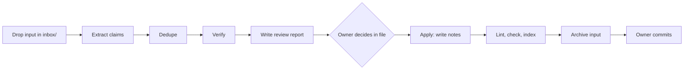

# ai-engineering-notes: Design

Date: 2026-10-04
Status: Draft for owner review

## 1. Purpose

This repository is a personal notebook of AI engineering knowledge and experience.

- Goal 1: Store knowledge so that the owner can read it again later.
- Goal 2: Share selected parts with other teams.

Out of scope: quizzes, flashcards, a website, and automatic commits.

## 2. Decisions

| Topic | Decision |
|---|---|
| Visibility | Private GitHub repository `ltlongtma/ai-engineering-notes`. |
| Language | English for all repository content and all exports. |
| Writing standard | ASD-STE100. STE-flavored mode for explanations. Strict mode for procedures, checklists, and prompt templates. |
| Input processing | An AI skill extracts, verifies, classifies, and writes notes. The owner approves every change before the skill writes a note. |
| Review channel | A review report file. The owner records decisions in the file. |
| Categories | Defined by the inputs. The repository starts with four placeholder topics. |
| Cross-topic notes | One primary topic folder plus optional secondary topics. |
| Source of truth | Markdown files in `topics/`. |
| Exports | Combined MD is the default. MDX and PDF are optional and run locally. |
| Diagrams | Mermaid by default. Archify for complex diagrams after owner approval. |

## 3. Repository layout

```
ai-engineering-notes/
├── README.md                    # purpose, workflow, topic index (generated section)
├── CONTRIBUTING.md              # ingest steps, review steps, STE rules, note template
├── inbox/                       # raw inputs
│   ├── links.md                 # one URL per line, optional comment after "#"
│   ├── notes/                   # owner's own insights, free form
│   └── archive/                 # processed inputs and their review reports
├── topics/
│   ├── context-and-memory/
│   ├── tokens-and-cost/
│   ├── tool-calling/
│   └── mcp/
│       ├── README.md            # one-line scope + generated note list
│       ├── <note-slug>.md
│       └── assets/              # diagram sources and rendered files
├── templates/
│   ├── note.md
│   └── review.md
├── .claude/skills/kb-ingest/
│   └── SKILL.md
├── tools/
│   ├── ste-lint.py              # vendored, see section 12
│   ├── ste_check.py             # wrapper: modes, markers, quotes (section 6)
│   ├── LICENSE.ste-lint         # MIT license of the vendored linter
│   ├── check_notes.py
│   ├── build_index.py
│   ├── export.py
│   └── tests/
│       └── fixtures/
├── docs/superpowers/            # specs and plans
├── Makefile
└── .github/workflows/
    ├── check.yml
    └── release.yml
```

Each placeholder topic contains only a `README.md` with a one-line scope:

- `context-and-memory`: context windows, short-term and long-term memory, compaction, retrieval for agents.
- `tokens-and-cost`: token counting, prompt caching, model choice by cost.
- `tool-calling`: tool design, schemas, error handling.
- `mcp`: MCP servers, clients, transports, and security.

The skill can propose a new topic. A new topic appears only after the owner approves it.

All tools in `tools/` use Python 3 and the standard library only.

## 4. Ingest workflow

The `kb-ingest` skill has two phases. Each phase starts on an explicit owner request.



### 4.1 Inputs

- `inbox/links.md`: URLs.
- `inbox/*.pdf`, `inbox/*.md`, `inbox/*.txt`: articles and documents.
- `inbox/notes/*.md`: the owner's own insights.

### 4.2 Phase 1: ingest

1. Extract. The skill reads each input and splits it into atomic claims. Each claim keeps a short quote from the input. A claim from `inbox/notes/` has `kind: experience`.
2. Dedupe. If `inbox/archive/` already contains the same URL, the skill skips the input and reports the skip. If a note on the same subject exists, the skill proposes an update to that note instead of a new note.
3. Verify. The skill verifies each claim against four criteria:
   - Correctness: correct, incorrect, or unverified.
   - Freshness: the claim matches the current version of the API, model, or tool.
   - Best practice: the claim matches current recommended practice.
   - Optimisation: a simpler, cheaper, or safer approach exists.
4. Sources for verification:
   - Context7 (`npx ctx7@latest library`, then `npx ctx7@latest docs`) for claims about a specific library or SDK.
   - Web search for conceptual claims. The skill uses official sources only: vendor documentation, changelogs, papers, and vendor engineering blogs.
   - If the skill cannot verify a claim, it marks the claim as unverified and states the reason. The skill does not use model training knowledge as proof.
5. For a claim with `kind: experience`, the skill verifies only the factual parts. It proposes corrections. It does not rewrite the owner's opinion.
6. Report. The skill writes `inbox/<slug>.review.md` from `templates/review.md`.

### 4.3 Review report format

Each claim is one block:

```markdown
### C3: "Claude context window is 100k tokens"
Status: ⚠️ outdated
Proposal: Replace with the current limit for each model. Cite the model page.
Sources: <url> (checked 2026-10-04)
Decision: [ ] accept  [ ] reject  [ ] edit: ...
```

Status values:

| Mark | Meaning |
|---|---|
| ✅ | Correct and current. |
| ⚠️ | Outdated, or not best practice, or can be optimised. |
| ❌ | Incorrect. |
| ❓ | Unverified. The block states the reason. |

The report also has one Placement block with its own Decision line. The Placement block contains:

- the primary topic and the secondary topics,
- any proposed new topic,
- any proposal to split the input into more than one note,
- any proposed diagram, with the tool (Mermaid or Archify).

### 4.4 Phase 2: apply

1. The skill reads the report. If one or more blocks have no decision, the skill stops and lists those blocks.
2. The skill writes new notes or updates existing notes from `templates/note.md`. It applies the accepted proposals and the owner's edits. It drops the rejected claims.
3. The skill writes the text with the `asd-ste100` skill rules (section 6).
4. The skill creates approved diagrams (section 7).
5. The skill runs `make check`. If a hard error occurs, the skill corrects it and runs `make check` again. The skill makes a maximum of two correction attempts. If errors remain, the skill reports them to the owner.
6. The skill moves the input and its report to `inbox/archive/<date>-<slug>/`.
7. The skill does not commit and does not push. The owner reads the diff and commits.

### 4.5 Extraction errors

Paywalls, dead links, and scanned PDFs can stop extraction. In this case:

- the report contains an `extract failed` block with the reason,
- the input stays in `inbox/`,
- the owner can paste the content into a `.md` file and run phase 1 again.

## 5. Note format

`templates/note.md`:

```markdown
---
title: Design MCP tool schemas for low token cost
topics: [mcp, tool-calling, tokens-and-cost]
sources:
  - url: https://...
    accessed: 2026-10-04
verified_at: 2026-10-04
confidence: high
last_reviewed: 2026-10-04
---

## Summary
## Details
## My takeaways
## Related
## Sources
```

Rules:

- `topics[0]` is the primary topic. The file is in `topics/<topics[0]>/`.
- File names are English `kebab-case`.
- `confidence` is `high`, `medium`, or `low`. A note with one or more unverified claims has `confidence: low`.
- The owner can keep an unverified claim. The note then marks that claim with `(unverified)` in the same sentence.
- `My takeaways` is optional. Only the owner writes this section. The skill does not write it.
- `Related` contains relative links to other notes.
- `Sources` lists each source and what the note takes from it.
- `last_reviewed` exists for a possible future re-verification feature. This design does not include that feature.

`check_notes.py` reports an error when:

- `topics[0]` is not the name of the folder that contains the note,
- a topic in `topics` has no folder,
- a link in `Related` does not resolve to a file,
- `sources` is missing or empty,
- a required frontmatter field is missing.

## 6. Writing standard

- The skill writes notes with the rules of the `asd-ste100` skill.
- Text outside markers uses STE-flavored mode. The linter enforces structural rules. Lexical rules are advisory.
- Text between `<!-- ste:strict -->` and `<!-- /ste:strict -->` uses Strict mode. Use this for steps, checklists, and prompt templates.
- The vendored `ste-lint.py` skips fenced code only. It has no modes and no markers. `tools/ste_check.py` wraps it and does these steps:
  1. It removes the frontmatter and blockquotes. Blockquotes hold verbatim quotes from sources.
  2. It runs `ste-lint.py` on the remaining text. Hard findings are errors. Advisory findings are warnings.
  3. It runs `ste-lint.py` again on each Strict block. In a Strict block, the sentence cap is 20 words, and passive voice and compound tenses are errors.
  4. It reports each finding with the line number of the original note.
- Errors fail `make check`. Warnings print only.
- The README states that the repository follows STE principles. It does not claim certified STE compliance, because the official ASD dictionary is not in the linter.

## 7. Diagrams

- Mermaid is the default. The diagram is a fenced `mermaid` block in the note. GitHub renders it. MD and MDX exports keep it.
- Archify is for complex diagrams, for example architecture or long sequence diagrams. The skill uses Archify only after the owner approves the diagram proposal.
- An Archify diagram keeps `assets/<name>.json` (source) and `assets/<name>.html` (rendered) in the repository. The note links to the HTML file.
- Exports need a static image. The implementation plan must verify whether Archify can produce a static SVG from the command line. If it can, the note embeds the SVG. If it cannot, the note also contains a short Mermaid diagram, and the Archify HTML stays a link.

## 8. Index generation

`build_index.py` reads the frontmatter of every note and regenerates:

- the note list in each `topics/<topic>/README.md`, including notes that list the topic as a secondary topic,
- the topic index section in the root `README.md`.

Generated sections sit between `<!-- index:start -->` and `<!-- index:end -->`. Nobody edits these sections by hand.

`build_index.py --check` fails when a generated section is not current.

## 9. Exports

`tools/export.py --format md|mdx|pdf --topic <name>|all`

| Format | Behavior | Where it runs |
|---|---|---|
| `md` | Combines notes into one file. Rewrites internal links to in-file anchors. Keeps Mermaid blocks. | Local and CI |
| `mdx` | Same as `md`. Converts frontmatter to a form that MDX accepts. Escapes `{`, `}`, and `<` outside code blocks. Does not build a website. | Local |
| `pdf` | Converts the combined MD to PDF with Pandoc and headless Chrome. | Local only. Needs Pandoc and Chrome. |

- A topic export includes the notes whose primary topic is that topic and the notes that list it as a secondary topic.
- The `all` export contains each note one time.
- Exported files go to `dist/`. Git ignores `dist/`.

## 10. Checks and CI

`make check` runs:

1. `ste_check.py` on all notes,
2. `check_notes.py`,
3. `build_index.py --check`,
4. the unit tests in `tools/tests/`.

Workflows:

- `check.yml` runs `make check` on each push and pull request. It needs Python 3 only.
- `release.yml` runs on a `v*` tag or a manual start. It builds the MD export for each topic and for `all`, then attaches the files to a GitHub Release.

## 11. Tests

The tools use the standard `unittest` module and fixtures in `tools/tests/fixtures/`.

- `check_notes`: one test for each error type in section 5.
- `build_index`: a note with a secondary topic appears in the index of both topics.
- `ste_check`:
  - a blockquote produces no finding,
  - a passive sentence is a warning outside a Strict block and an error inside it,
  - a 22-word sentence passes outside a Strict block and fails inside it,
  - the reported line number matches the original note.
- `export`:
  - internal links point to the correct anchors,
  - MDX output escapes `{`, `}`, and `<` outside code blocks,
  - a topic export includes cross-listed notes,
  - the `all` export contains each note one time.

The `kb-ingest` skill has no unit tests. Acceptance for the skill is one real run of both phases with one URL and one owner note.

## 12. Vendored linter

- Source: `danyuchn/asd-ste100-skill`, file `scripts/ste-lint.py`.
- The implementation plan records the exact commit.
- `tools/LICENSE.ste-lint` keeps the MIT license of that file.
- `CONTRIBUTING.md` tells authors to install the skill with `npx skills add danyuchn/asd-ste100-skill`.

## 13. Acceptance criteria

1. The private repository contains the layout in section 3.
2. `make check` passes on the initial commit and in CI.
3. A real run of `kb-ingest` on one URL and one owner note produces a review report with claim blocks and a Placement block.
4. After the owner records decisions, phase 2 writes notes that pass `make check` and updates the indexes.
5. Phase 2 stops and lists the blocks that have no decision.
6. `tools/export.py --format md --topic <name>` includes cross-listed notes.
7. `tools/export.py --format mdx` and `--format pdf` run locally and produce files in `dist/`.
