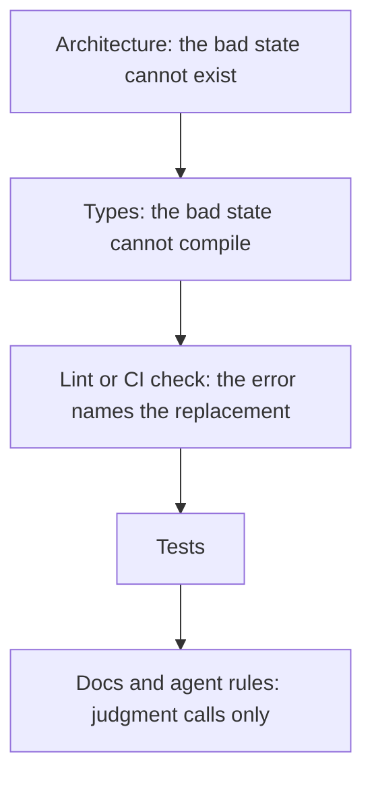

## Summary

An instruction to an agent is advisory, and a check is deterministic.
When the same mistake happens twice, replace the instruction with the strongest mechanism that works, and delete the text.
Prove that each new check fails on a real past mistake.
Keep a table that pairs each rule with the mechanism that enforces it.

## Details

The top level is the strongest.

### Write it twice, then encode it

> When you catch yourself writing the same instruction a second time ... If yes, encode it. Delete the instruction

pstack orders mechanisms from strongest to weakest.
First comes a state that cannot compile, then a lint or banned API that fails CI, then a canonical helper, then a runtime check.
If a rule needs judgment, pstack keeps the text, makes it more visible, and adds an example of the failure.
Claude Code docs support the idea: CLAUDE.md instructions are advisory, and hooks are deterministic.

### Fix each mistake class at the highest level

> A class counts once it has happened twice ... Fix each class at the highest level that works

The correct skill counts a mistake class once the same mistake happened twice.
Docs come last, because nothing fails when an agent skips them.

> Prove each new check fails on a real past mistake. Run the same command locally and in CI.

An exception goes on the line that breaks the rule, with a reason, an expiry date, and the approval of a person.

> keep a table in the agent instruction file that pairs each rule with what enforces it

When the operator corrects an agent, the agent fixes the mistake and adds the rule to the table.
If the rule existed and nothing enforced it, the correction is a repeat.
Then the agent fixes it at the highest level in the same change.
The agent removes a rule when its mistake cannot happen.

### Build the tool

> When the work isn't trivial, build the tool that does it instead of doing it by hand.

For non-trivial work, pstack builds a script, a codemod, or a generator.
The tool gives one artifact that a reviewer can read and run again.
The agent does the first unit by hand, builds the tool, and compares the tool output with the hand result.
The bar is triviality, not repetition.

### Self-review pushes rules into code

> For any item that would be enforced more reliably by a lint rule ... move it from Accepted to Backlog

The reflect skill starts three reviewers on the session transcript, one for each lens: judgment, tooling, and divergent.
A synthesizer merges the findings into Accepted, Rejected, and Backlog lists.
An item that a lint rule, a script, or a runtime check can enforce moves from Accepted to Backlog.
Skill text is only for things that a mechanism cannot enforce.
The user approves the Accepted list before the agent applies an edit.

## My takeaways

- When I write the same rule for an agent two times, I make a check for it in `make check`.
- A new check must fail on a real past mistake before I keep it.
- In this repository, the STE linter and `check_notes.py` are examples of this rule.

## Related

- [Assign agents by role, not by model name](../workflows/assign-agents-by-role.md)
- [Prove the work on the real artifact](../workflows/prove-the-work-on-the-real-artifact.md)
- [Treat the spec as the source of truth](../workflows/spec-is-the-source-of-truth.md)

## Sources

- pstack plugin: `principle-encode-lessons-in-structure`, `correct`, `principle-build-the-lever`, and `reflect`. https://github.com/cursor/plugins/tree/main/pstack
- Claude Code: best practices, CLAUDE.md is advisory. https://code.claude.com/docs/en/best-practices
- Claude Code: hooks guide, hooks are deterministic. https://code.claude.com/docs/en/hooks-guide
