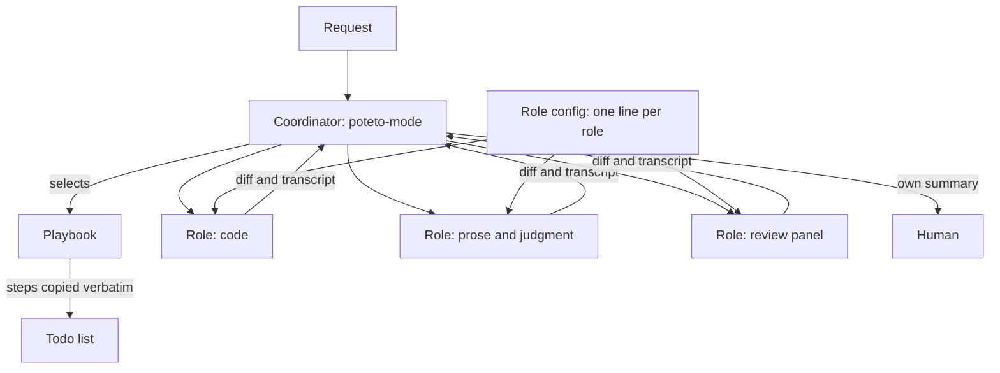

## Summary

A multi-agent setup works better when each agent has a role, and a config maps each role to a model.
The pstack plugin for Cursor uses this design.
A coordinator routes the work, worker roles write code or prose, and review roles check the result on a different model.
Skills name a role and never a model, so a model change touches one config file.
The coordinator owns each result and does not forward the self-report of a worker.

## Details

### Roles, not model names

> explicit model per role (configurable via `/setup-pstack`. Defaults `grok-4.7-xhigh-fast` for code, `claude-opus-5-5-max` for prose and judgment)

Each subagent call in pstack names a role, and the role selects the model.
The default roles are code, prose and judgment, and the review panels.
The pstack README shows the cost of model names in rules: a rule from before version 0.15.3 pins the old default models.
Keep the role names stable and treat model names as examples that expire.

> Write `~/.cursor/rules/pstack-models.mdc`, an always-applied rule that sets pstack's model per role.

The setup-pstack skill detects the available models, asks for a reasoning budget, and writes one rule file with one line per role.
Roles include bug-fix, judgment and prose, hardest tasks, and the arena runners.
The values `inherit-parent` and `auto` run the role on the parent chat model.
Claude Code has a similar design.
A subagent has its own context window, system prompt, tool access, and permissions.
Its `model` field accepts an alias such as `sonnet`, `opus`, or `haiku`, a full ID, or `inherit`.
Its `effort` field sets the reasoning budget.

### The coordinator role

> it reads your request, picks from a set of playbooks, and runs the other skills as the steps need them.

The entry skill `/poteto-mode` reads the request, selects one of twenty-three playbooks, and runs other skills when a step needs them.
This is the routing workflow from Anthropic's guide: classify the input, then send it to a specialized task.
The same guide advises the simplest design that works, so a large number of playbooks is a cost to watch.

> the matched playbook's steps, copied in verbatim, before any task-specific todos. ... A step you choose not to do stays in the list

The coordinator copies the playbook steps word for word into its todo list.
A step that it does not do stays in the list with a one-line `skip: <reason>`.
Thus a reviewer can see each omission.

> twenty-four short skills, one principle each. `poteto-mode` indexes them inline and reads that index at task start.

Each principle is a short skill with one rule.
The coordinator holds an inline index of the principles and reads the full rule only when necessary.
Claude Code best practices give the same advice: put occasional knowledge in skills, and keep always-loaded files short.

### Give each role its rules

> it reads `poteto-mode` in full, including its inline principles index, before doing any work. substituting `generalPurpose` skips that read and drifts.

A subagent starts in a fresh context.
It does not see the skills or the files that the parent read.
The pstack worker agent tells itself to read the coordinator skill first.
In Claude Code, the `skills` frontmatter field of a subagent injects the full skill content at startup.
Thus the rules do not depend on an instruction to read a file.
No source measures how much a general-purpose agent drifts.

> Fresh subagents by default. Give new work to a fresh subagent with consolidated scope

Each fix round, follow-up, retry, or next queue item goes to a fresh subagent.
The coordinator gives it the original brief, every later directive, and the report and branch of the prior agent.
Claude Code best practices give similar advice: execute a spec in a fresh session with a clean context.

### Review roles

> A second opinion is the same prompt against a different model. Agreement is high-signal.

A review role runs the same prompt on a different model.
It does not use a different persona.
The claim that agreement between models is a strong signal has no measurement (unverified).

### The coordinator owns the result

> You own every subagent's work. Review the diff and write your own summary, don't pass through what it said.

The coordinator reads the diff of each worker and writes its own summary for the human.
It does not forward the report of the worker.

### When the coordinator stops for the human

> Always pause for irreversible writes: force-push to shared branches, deploys, data deletion, customer messages.

pstack tells the agent to continue without a question on reversible work and to pause for irreversible writes.
This is a prompt instruction, so the model can ignore it.
Claude Code hooks and permission rules are deterministic, for example an ask rule on `Bash(git push *)`.
Checkpoint rewind does not undo Bash changes such as `rm` or `mv`, and it does not restore subagent edits.
Only version control gives a dependable undo.

### Large tasks with no playbook

> The definition of done as a falsifiable predicate ... Build the verification harness before the work ... measure against the predicate on the real artifact

For a large task with no playbook, the figure-it-out skill first states done as a falsifiable predicate.
It builds the verification harness before the work and records a baseline.
It runs each unit as a loop: make the smallest change, measure against the predicate, then keep or revert.
Claude Code best practices agree: give Claude a check that it can run.

## My takeaways

- I keep the role idea from pstack: each agent has one role, and one config maps each role to a model.
- My skills and agents name a role, not a model. A model change then touches one file.
- I use a different model for the review role than for the worker role.
- I accept the pause rule for irreversible writes. I enforce it with permission rules, not only with a prompt.

## Related

- [Treat the spec as the source of truth](spec-is-the-source-of-truth.md)
- [Prove the work on the real artifact](prove-the-work-on-the-real-artifact.md)
- [Encode lessons in checks, not in instructions](../guardrails/encode-lessons-in-checks.md)
- [Blind evals for skills and models](../evals-and-observability/blind-evals-for-skills-and-models.md)

## Sources

- pstack plugin: README, `poteto-mode`, `setup-pstack`, `figure-it-out`, `principle-never-block-on-the-human`, and `agents/poteto-agent.md`. https://github.com/cursor/plugins/tree/main/pstack
- Anthropic: building effective agents, the routing workflow. https://www.anthropic.com/engineering/building-effective-agents
- Claude Code: subagents, the `model`, `effort`, and `skills` fields. https://code.claude.com/docs/en/sub-agents
- Claude Code: best practices, skills, checks, and fresh sessions. https://code.claude.com/docs/en/best-practices
- Claude Code: checkpointing, the limits of rewind. https://code.claude.com/docs/en/checkpointing
- Claude Code: permission modes. https://code.claude.com/docs/en/permission-modes
