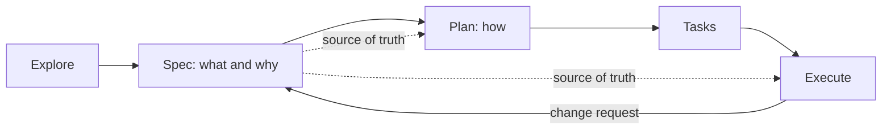

## Summary

The owner uses four steps: explore, spec, plan, then execute.
The spec has higher trust than the plan, because the plan comes from the spec.
GitHub spec-kit states the same idea: the spec is the source of truth, and the plan and the code come from it.
The pstack author skips planning by default, and Claude Code best practices disagree for multi-file work.

## Details

### Two opinions

> i don't believe in planning. the best spec is code.

The pstack README states this personal opinion.
It also says that Cursor's plan mode works with pstack, and that poteto-mode plans on request but not by default.
Claude Code best practices recommend a different default: explore, plan, then code.
Planning helps most when the approach is uncertain, when the change touches multiple files, or when the code is unfamiliar.
For a larger feature, the same docs say to let Claude interview you, write a spec to `SPEC.md`, and execute it in a fresh session.

### Spec-driven development

> Define what and why before deciding how to build it.

spec-kit puts the spec before the plan.
A project writes a constitution one time.
Each feature then goes through specify, plan, tasks, implement, and converge.
The agent repeats implement and converge until the converge step reports "Converged".
Clarification, checklists, and consistency analysis are optional quality gates.

> specifications as the central source of truth, with implementation plans and code as the continuously regenerated output

spec-kit calls this idea the power inversion: code serves the specification.
The plan maps each requirement to a technical decision, and each decision traces back to a requirement.
Thus a change starts in the spec, and the plan follows.
This is the philosophy of spec-kit, not a measured result.

### Mark ambiguity, do not guess

> Instead of guessing that a "login system" uses email/password authentication, the LLM must mark it as

The spec-kit templates make the agent mark each ambiguity as `[NEEDS CLARIFICATION: <specific question>]`.
A spec is not complete while one marker remains.
spec-kit says that this rule prevents plausible but incorrect assumptions.
No source measures this effect.

### The constitution

> At the heart of SDD lies a constitution—a set of immutable principles that govern how specifications become code.

The constitution is a file of fixed project principles in `memory/constitution.md`.
The plan step checks each plan against it through gates, for example the Simplicity Gate (Article VII) and the Anti-Abstraction Gate (Article VIII).
The implementation template also enforces test-first development.
These gates are text in a template, not code that fails a build.
Thus a gate that the agent skips again is a candidate for a mechanical check.

## My takeaways

- My workflow is explore, spec, plan, then execute. I do not skip the plan like the pstack author.
- I trust the spec more than the plan, because the plan comes from the spec.
- When the work changes direction, I change the spec first. Then I make the plan again.
- I use the spec-kit marker `[NEEDS CLARIFICATION]` as a habit: the agent marks a gap and does not guess.

## Related

- [Assign agents by role, not by model name](assign-agents-by-role.md)
- [Encode lessons in checks, not in instructions](../guardrails/encode-lessons-in-checks.md)
- [Label the confidence of each claim](../human-in-the-loop/label-the-confidence-of-each-claim.md)

## Sources

- GitHub spec-kit: README and `spec-driven.md`, the workflow, the power inversion, the clarification marker, and the constitution. https://github.com/github/spec-kit
- pstack plugin: README, the opinion on planning. https://github.com/cursor/plugins/tree/main/pstack
- Claude Code: best practices, explore, plan, then code, and the `SPEC.md` interview. https://code.claude.com/docs/en/best-practices
